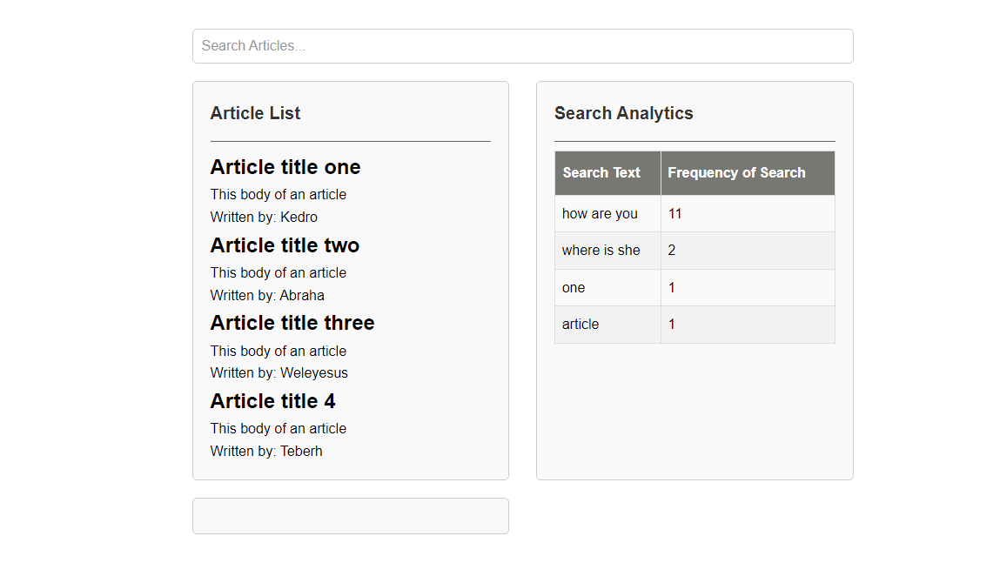

# Real-Time Search Analytics

This project is a demonstration of a real-time search analytics application, developed as part of the Helpjuice Full-Stack Internship Test. It showcases real-time search functionality for articles and provides analytics on these searches.

Built with Ruby on Rails as the backend API and Vanilla JavaScript for the front-end, this application combines the power of a robust backend framework with a lightweight, efficient front-end solution.

Additionally, the backend API and frontend are deployed on different servers, emphasizing the concept of building web apps with APIs in mind and maintaining a clear separation of concerns.


- **Deployed App:** [Search Analytics App](https://real-time-search-analytics.netlify.app/)
- **GitHub Repository:** [Search Analytics Engine](https://github.com/keddo/search-analytics-engine)

## Features
- Real-time search functionality for articles.
- Analytics dashboard displaying search trends and patterns.
- IP-based user tracking to segregate search data per user.
- Scalable architecture to handle high volumes of requests.
- Optimized for performance and instantaneous search experience.

## Getting Started
### Prerequisites
- Ruby 3.3.0
- Rails 7.1.3
- PostgreSQL

### Installation
1. Clone the repository and install the dependencies:
    ```bash
    git clone https://github.com/keddo/search-analytics-engine.git
    cd search-analytics-engine
    bundle install
    rails db:create db:migrate
    ```

### Running Locally

To run the application locally, follow these steps:

#### API Server
- Start the API server using the following command:
```bash
  rails s
```

- Alternatively, you can use:
```bash
  rails server
```
### Front-end
```bash
- For the front-end, you have two options:
- If using Visual Studio Code, launch the live server by clicking "Go Live" in the bottom right corner.
- Alternatively, open the index.html file in your web browser.
```

### Testing
- To run the test suite, use the following command:
```bash
bundle exec rspec
```
### Author
**Kedro**
- GitHub: [@keddo](https://github.com/keddo)
- LinkedIn: [Kedir Abdurahman](https://www.linkedin.com/in/keddo/)

## Acknowledgments

- I would like to express my gratitude to the following platforms for their invaluable support in deploying this application:

- **Netlify**: I extend my sincere appreciation to Netlify for providing their free tier deployment services for the front-end Vanilla JavaScript of this project. Their platform made it seamless to deploy and manage the front-end portion of the application.

- **Render**: A heartfelt thank you to Render for enabling me to deploy my backend API using Ruby on Rails. Render's efficient deployment solutions facilitated the deployment process and ensured the smooth functioning of the backend of this application.

- Without the support of Netlify and Render, this project would not have been possible. Their contributions have been instrumental in bringing this application to life.

- Special thanks to the Helpjuice team for providing the opportunity to participate in this challenge.
